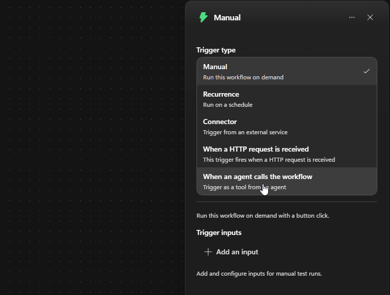
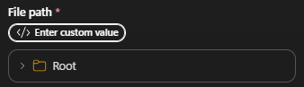
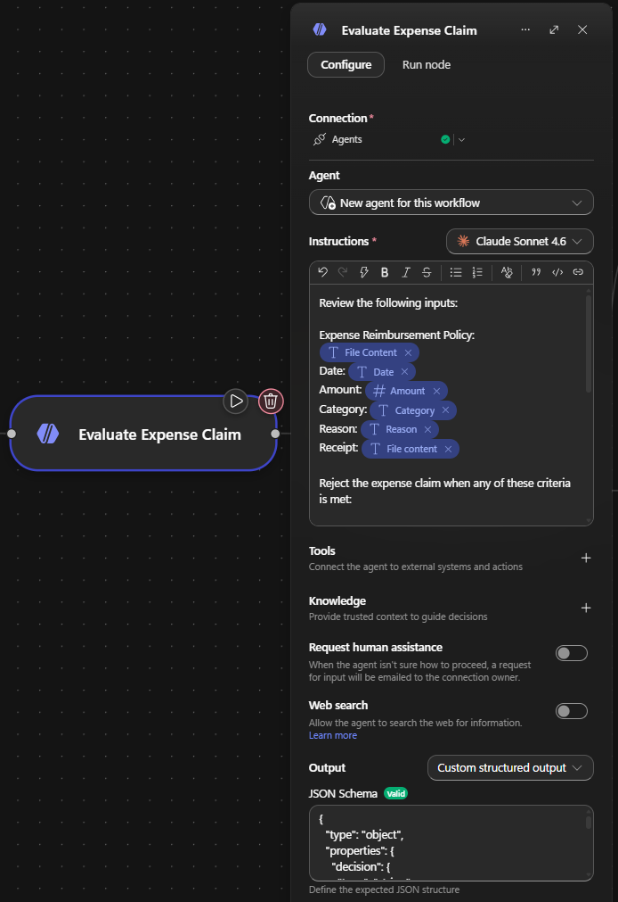
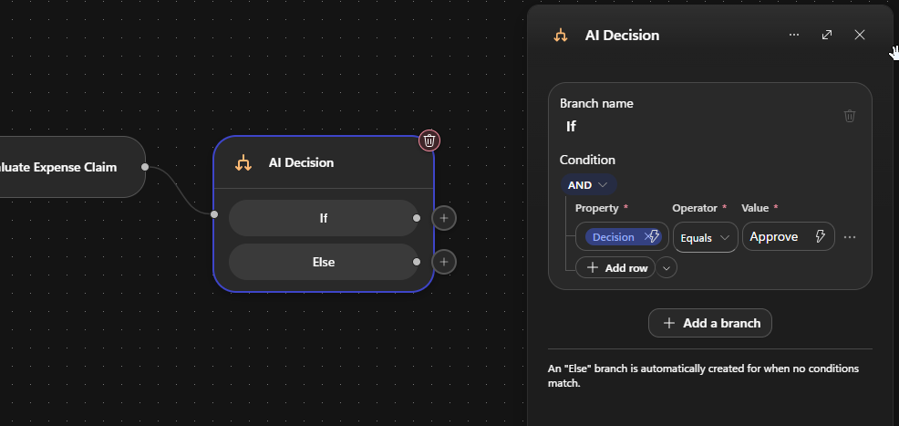
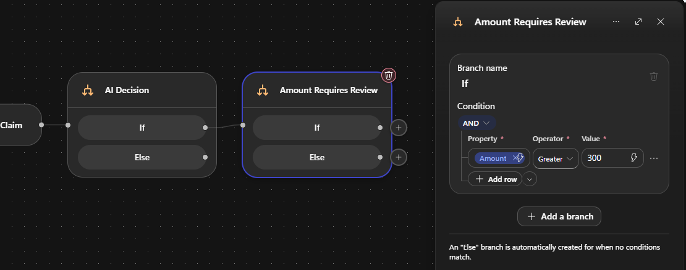
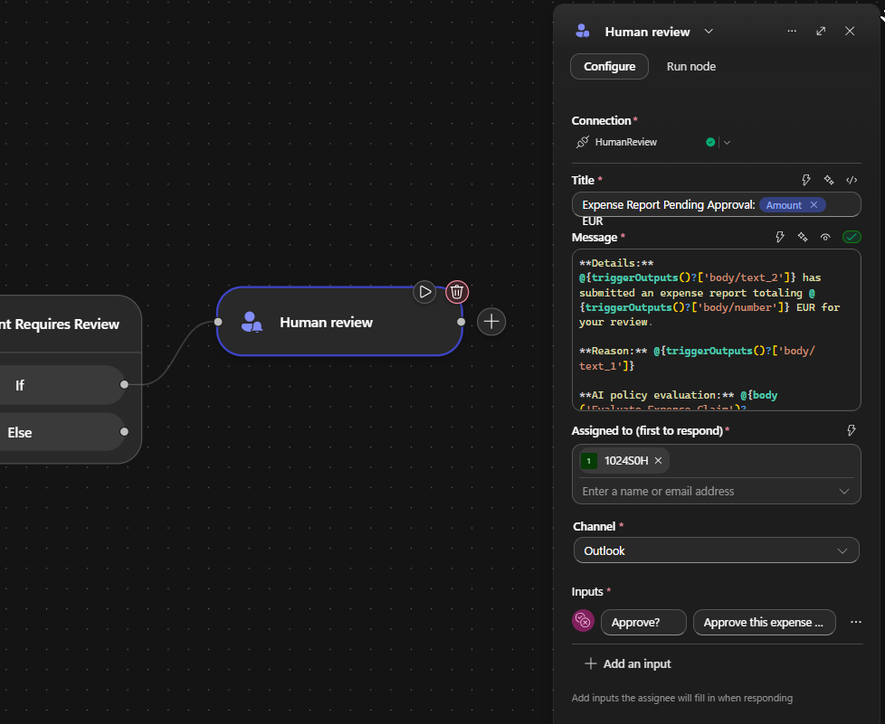
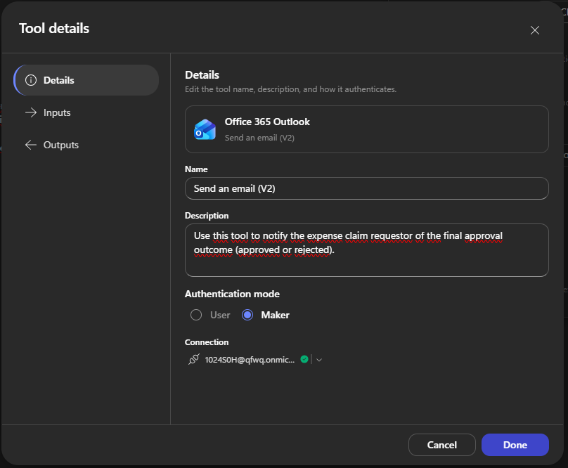
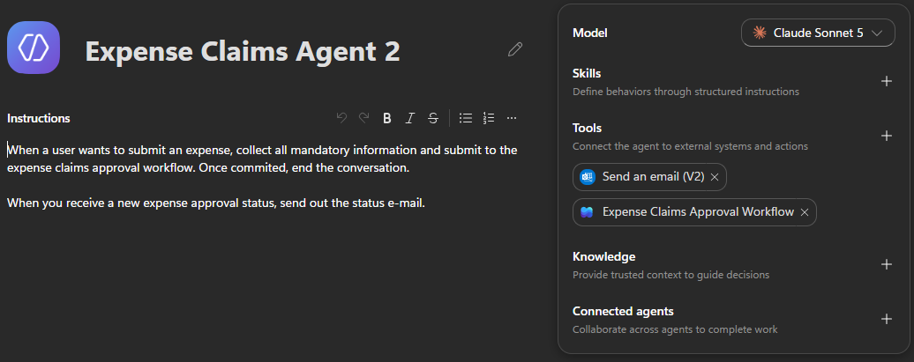
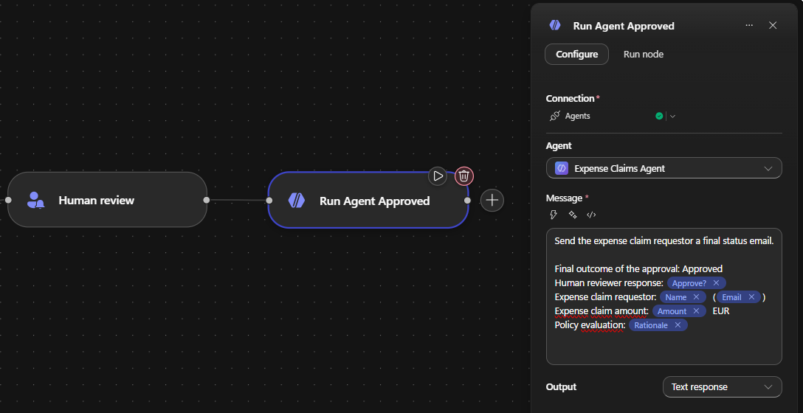
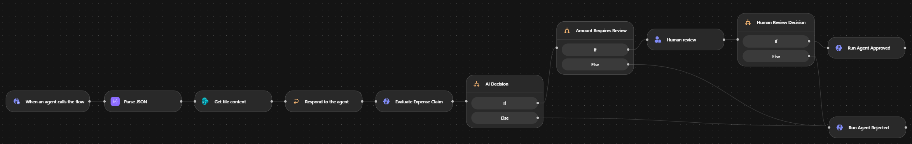

# Expense Claims Agent with Workflow Approvals (Human-in-the-Loop)

Build an end-to-end expense claims solution with an agent powered by the GitHub Copilot harness. The agent collects an employee's expense details, stores the uploaded receipt in OneDrive, and sends its file path to a workflow. The workflow retrieves the receipt, evaluates the claim against policy with an inline agent, routes higher-value claims to a human reviewer, and emails the employee with the final outcome.

---

## 🧭 Lab Details

| Level | Persona | Duration   | Purpose                                                                                                                                                              |
| ----- | ------- | ---------- | -------------------------------------------------------------------------------------------------------------------------------------------------------------------- |
| 200   | Maker   | 45 minutes | Build an agent powered by the GitHub Copilot harness that invokes a workflow with AI policy evaluation, conditional routing, human review, and outcome notification. |

---

## 📚 Table of Contents

---

## 🤔 Why This Matters

Expense claims are a classic high-volume, high-friction process:

- Employees want fast decisions and clear outcomes.
- Finance teams want consistent policy enforcement.
- Managers want to review only the claims that require human judgment.

This lab demonstrates how agents and workflows can divide those responsibilities. The user-facing agent gathers the information and sends notifications. The workflow provides predictable orchestration, while an inline agent makes the policy decision and a human reviewer handles higher-value claims.

---

## 🌐 Introduction

In this lab, you create two components in the new Microsoft Copilot Studio experience:

1. An **Expense Claims Approval Workflow** that receives expense data and a OneDrive file path, retrieves the receipt and reimbursement policy, evaluates the claim with an inline agent, and requests human review when required.
2. An **Expense Claims Agent** powered by the GitHub Copilot harness that stores uploaded receipts in OneDrive and uses the workflow and Office 365 Outlook as tools.

After both components are published, you return to the workflow and add two Agent nodes. These nodes call the published agent with either an approved or rejected outcome, allowing the agent to use its email tool to notify the requestor.

> [!NOTE]
> Agents and workflows powered by the GitHub Copilot harness use Copilot Credits for usage-based billing. Building, testing, evaluating, and running the components in this lab might consume Copilot Credits.

---

## 🎓 Core Concepts Overview

| Concept                    | Why it matters                                                                                                                                                                    |
| -------------------------- | --------------------------------------------------------------------------------------------------------------------------------------------------------------------------------- |
| **GitHub Copilot harness** | Provides the enhanced orchestration and reasoning runtime used by the new agent and workflow experiences.                                                                         |
| **Workflow**               | Coordinates deterministic steps, AI reasoning, branching, human review, and downstream actions in a visual designer.                                                              |
| **Inline agent**           | Performs a task that is specific to one workflow. Its instructions, inputs, and output stay with the workflow.                                                                    |
| **Human review**           | Pauses the workflow, requests information from an assigned reviewer through Outlook, and makes the response available to later steps.                                             |
| **Tools**                  | Give the agent access to external actions. This lab adds OneDrive **Create file**, a workflow, and Office 365 Outlook **Send an email (V2)** as tools.                            |
| **OneDrive file path**     | Provides a connector-native reference. **Create file** returns this path, and the workflow uses **Get file content using path** to retrieve the stored receipt deterministically. |
| **Agent node**             | Calls an inline agent or an existing published agent directly from a workflow.                                                                                                    |

---

## 📄 Documentation and Additional Training Links

- [Microsoft Copilot Studio documentation](https://learn.microsoft.com/microsoft-copilot-studio/)
- [Agents powered by the GitHub Copilot harness](https://learn.microsoft.com/microsoft-copilot-studio/agents-experience/overview)
- [Workflows overview](https://learn.microsoft.com/microsoft-copilot-studio/workflows-experience/flows-overview)
- [Add an agent node to a workflow](https://learn.microsoft.com/microsoft-copilot-studio/workflows-experience/agent-node-workflow)
- [Request information from human review in workflows](https://learn.microsoft.com/microsoft-copilot-studio/workflows-experience/flows-request-for-information)
- [Add a workflow to your agent as a tool](https://learn.microsoft.com/microsoft-copilot-studio/agents-experience/tools-add-workflow)
- [Add a tool to an agent](https://learn.microsoft.com/microsoft-copilot-studio/agents-experience/add-tools-custom-agent)
- [OneDrive for Business connector](https://learn.microsoft.com/connectors/onedriveforbusiness/)
- [Office 365 Outlook connector](https://learn.microsoft.com/connectors/office365/)

---

## ✅ Prerequisites

- Access to Microsoft Copilot Studio and the new agents and workflows experience
- An environment with permission to create agents, workflows, connections, and tools
- Copilot Credits available for GitHub Copilot harness usage
- Access to SharePoint Online and the sample expense reimbursement policy in **Lab Resources**
- A sample receipt file from **Lab Resources**
- Access to OneDrive for Business with a folder named `/receipts`
- Access to Office 365 Outlook
- The name and email address of a reviewer in your tenant

> [!IMPORTANT]
> Human review requests are sent through Outlook. The assigned reviewer must belong to your tenant.

---

## 🎯 Summary of Targets

By the end of this lab, you will be able to:

- Create a workflow that an agent can call as a tool
- Store an uploaded receipt in OneDrive and pass its returned file path to a workflow
- Retrieve the stored receipt from OneDrive and a policy document from SharePoint
- Configure an inline agent to approve or reject a claim against explicit policy criteria
- Use structured agent output to route the workflow
- Send claims over 300 EUR to a human reviewer
- Create a minimal agent powered by the GitHub Copilot harness
- Add OneDrive, workflow, and Outlook actions as agent tools
- Call the published agent from approved and rejected workflow paths
- Test automated approval, human review, and rejection scenarios

---

## 🧩 Use Cases Covered

| Step | Use Case                                                                                              | Value added                                                                                        | Effort |
| ---- | ----------------------------------------------------------------------------------------------------- | -------------------------------------------------------------------------------------------------- | ------ |
| 1    | [Build the Expense Claims Approval Workflow](#-use-case-1-build-the-expense-claims-approval-workflow) | Combines receipt and policy retrieval, inline AI evaluation, conditional routing, and human review | 20 min |
| 2    | [Create the Expense Claims Agent](#-use-case-2-create-the-expense-claims-agent)                       | Provides a conversational interface with reusable OneDrive, workflow, and email tools              | 10 min |
| 3    | [Complete the Workflow Response Paths](#-use-case-3-complete-the-workflow-response-paths)             | Returns approved and rejected outcomes to the agent for email notification                         | 10 min |
| 4    | [Test the End-to-End Solution](#-test-the-end-to-end-solution)                                        | Verifies OneDrive persistence plus automated, human-reviewed, and rejected workflow paths          | 5 min  |

---

## 🛠️ Instructions by Use Case

---

## 🧱 Use Case #1: Build the Expense Claims Approval Workflow

Create a workflow that receives expense details and a OneDrive receipt path from an agent, retrieves the receipt and reimbursement policy, evaluates the claim, and requests human review for an approved claim over 300 EUR.

| Use case                                   | Value added                                                                 | Estimated effort |
| ------------------------------------------ | --------------------------------------------------------------------------- | ---------------- |
| Build the Expense Claims Approval Workflow | Automates policy evaluation and routes only higher-value claims to a person | 20 minutes       |

### Create the workflow and trigger

1. Go to [copilotstudio.microsoft.com](https://copilotstudio.microsoft.com/).
2. Confirm that you are in the correct environment. In these labs, the environment name should start with **DEV - \<your current user name\>**.
3. In the left navigation, select **Workflows**.
4. Select **New workflow**.
5. Select the **Start** node to open its configuration pane.
6. Under **Trigger type**, select **When an agent calls the workflow**.

> [!NOTE]
> After you select the trigger, the node on the canvas might display **When an agent calls the flow**. This is the trigger required for exposing the published workflow as an agent tool.



7. Select the automatically added **Respond to the agent** node, select **...** (**More commands**), and then select **Delete**.
8. Under **Trigger inputs**, select **Add an input** and create the following inputs:

   | Type   | Name              | Description                                               |
   | ------ | ----------------- | --------------------------------------------------------- |
   | Date   | `Date`            | Date of the expense                                       |
   | Number | `Amount`          | Total claim amount in EUR                                 |
   | Text   | `Category`        | Expense category                                          |
   | Text   | `Reason`          | Business reason for the expense                           |
   | Text   | `ReceiptFilePath` | OneDrive path returned after storing the uploaded receipt |
   | Text   | `Name`            | Requestor's display name                                  |
   | Text   | `Email`           | Requestor's email address                                 |

### Retrieve the receipt from OneDrive

9. Select **Add a step** after the trigger.
10. Search for and add **Get file content using path** from the **OneDrive for Business** connector.
11. Sign in with your training account if Copilot Studio prompts you to create a connection.
12. Under **File Path**, select **Enter custom value** so the field accepts dynamic content instead of requiring you to select a folder.



13. In **File Path**, use the dynamic content picker to insert **ReceiptFilePath** from the workflow trigger. Rename the node to `Get Receipt Content`.

The action returns the binary content of the receipt that the inline agent evaluates. Use the OneDrive path returned by **Create file**, not a browser or sharing URL.

### Retrieve the reimbursement policy

14. Select **Add a step** after **Get Receipt Content**.
15. Search for and add **Get file content** from the **SharePoint** connector.
16. Sign in with your training account if Copilot Studio prompts you to create a connection.
17. For **Site Address** and **File Identifier**, use the values provided in **Lab Resources**. Rename the node to `Get Policy Content`.

### Return immediately to the calling agent

18. Select **Add a step** after **Get Policy Content**.
19. Add **Respond to the agent** and leave the response empty.

> [!TIP]
> The workflow returns control to the calling agent before it starts the potentially long-running review process. The remaining workflow steps continue after the response.

### Name and save the workflow

20. Name the workflow `Expense Claims Approval Workflow`.
21. Select **Save**.

### Add the inline policy evaluation agent

22. Select **Add a step** after **Respond to the agent**.
23. On the Add panel, select **Agent**.
24. Under **Agent**, select **New agent for this workflow**.
25. Open the **Model** selector for the new workflow agent and select **Claude Sonnet 5**.
26. In **Instructions**, enter the following content. For each value in square brackets, use the dynamic content picker to insert the corresponding output from an earlier step.

```text
Review the following inputs:

Expense Reimbursement Policy: [File Content from Get Policy Content]
Date: [Date]
Amount: [Amount]
Category: [Category]
Reason: [Reason]
Receipt: [File Content from Get Receipt Content]

Reject the expense claim when any of these criteria is met:

1. Effective period validation: Reject the claim if any expense date falls outside the policy's defined effective period.
2. Allowed category validation: Reject the claim if any expense isn't within the policy's approved expense categories.
3. Receipt validation: Reject the claim if a receipt is missing or if required receipt details defined in the policy are incomplete or unclear.
4. Budget and limit enforcement: Reject the claim if any category limit, monthly limit, or total reimbursement limit defined in the policy is exceeded.

Approve the claim only when none of the rejection criteria is met. Return a decision of Approve or Reject and a concise rationale. If rejecting the claim, identify every criterion that caused the rejection.
```

27. Under **Output**, select **Custom structured output**.
28. Use the following JSON schema:

```json
{
  "type": "object",
  "properties": {
    "decision": {
      "type": "string",
      "enum": ["Approve", "Reject"],
      "description": "The final policy evaluation decision."
    },
    "rationale": {
      "type": "string",
      "description": "A concise explanation of the decision and all rejection criteria that were met."
    }
  },
  "required": ["decision", "rationale"],
  "additionalProperties": false
}
```

29. Rename the node to `Evaluate Expense Claim`.



### Route the inline agent decision

30. Select **Add a step** after **Evaluate Expense Claim** and add **If/Else**.
31. Rename the node to `AI Decision`.
32. Configure the **If** branch: - **Property**: `decision` from **Evaluate Expense Claim** - **Operator**: **Is equal to** - **Value**: `Approve`



The **If** branch handles policy-compliant claims. The **Else** branch handles rejected claims and will be connected to the rejection response in Use Case #3.

### Route higher-value claims to human review

33. On the **If** output of **AI Decision**, add another **If/Else** node.
34. Rename the node to `Amount Requires Review`.
35. Configure its **If** branch: - **Property**: `Amount` from the workflow trigger - **Operator**: **Greater than** - **Value**: `300`

The **If** branch requires human review. The **Else** branch is automatically approved and will be connected to the approved response in Use Case #3.



36. On the **If** output of **Amount Requires Review**, select **Add a step**.
37. Search for **Human review** and select **Request for information**.
38. Create or select a **Human review** connection.
39. Configure the node: - **Title**: `Expense Report Pending Approval: {Amount} EUR` - **Message**:

```md
**Details:**
{Name} has submitted an expense report totaling {Amount} EUR for your review.

**Reason:** {Reason}

**AI policy evaluation:** {rationale}
```

40. Replace each `{...}` placeholder with dynamic content: - `Amount`, `Name`, and `Reason` from the workflow trigger - `rationale` from **Evaluate Expense Claim**

> [!TIP]
> If the visual input for **Message** isn't working, select the code input option (**</>**) and use this alternative message:
>
> ```text
> **Details:**
> @{triggerOutputs()?['body/text_2']} has submitted an expense report totaling @{triggerOutputs()?['body/number']} EUR for your review.
>
> **Reason:** @{triggerOutputs()?['body/text_1']}
>
> **AI policy evaluation:** @{body('Evaluate_Expense_Claim')?['structuredOutput/rationale']}
> ```

41. In **Assigned to (first to respond)**, enter the name or email address of your reviewer.
42. For **Channel**, select **Outlook**.
43. Under **Inputs**, select **Add an input** and configure: - **Type**: **Yes/No** - **Name**: `Approve?` - **Description**: `Approve this expense claim?`



### Save and publish the initial workflow

44. Select **Save**.
45. Select **Publish**.

> [!IMPORTANT]
> A workflow must be published and must contain both **When an agent calls the flow** and **Respond to the agent** before it can be added to an agent as a workflow tool.

The workflow's final branches are intentionally incomplete. You finish them after creating and publishing the agent in Use Case #2.

---

### 🏅 Congratulations! You've completed Use Case #1!

---

## 🔄 Use Case #2: Create the Expense Claims Agent

Create a new agent powered by the GitHub Copilot harness. Keep its instructions focused and give it only the tools required to store receipts, submit expense claims, and notify requestors.

| Use case                        | Value added                                                                                 | Estimated effort |
| ------------------------------- | ------------------------------------------------------------------------------------------- | ---------------- |
| Create the Expense Claims Agent | Collects claim details, stores the receipt, runs the workflow, and emails the final outcome | 10 minutes       |

### Create the agent

1. Return to the Copilot Studio **Home** page.
2. Select the option to create a new **Agent** in the new experience.
3. Name the agent `Expense Claims Agent`.
4. Create the agent.
5. On the **Build** tab, open the **Model** selector and select **Claude Sonnet 5**.
6. Replace the agent's instructions with:

```text
When a user wants to submit an expense, collect the date, amount, category, reason, and receipt attachment.

Before submitting the claim, use Create file to store the uploaded receipt in the /receipts folder in OneDrive. Use the uploaded attachment's file name and content. Then run the expense claims approval workflow and set ReceiptFilePath to the Path returned by Create file. Never ask the user for a OneDrive path or use a browser or sharing URL.

For the workflow's Name and Email inputs, use the display name and email address of the currently signed-in user. Do not ask the user to provide these values.

After the workflow is committed, end the conversation.

When you receive a new expense approval status, send out the status email.
```

### Add the OneDrive receipt tool

7. In the components panel on the right, select **Tools**.
8. Select **Add**, and then select **Connectors**.
9. Search for **OneDrive for Business**.
10. Select **Create file** and add it to the agent.
11. Sign in with your training account if prompted.
12. On the **Details** tab, set **Description** to:

```text
Use this tool first when submitting an expense claim. Store the receipt attachment in OneDrive and use the returned Path as the ReceiptFilePath input for the expense claims approval workflow.
```

13. Set **Authentication mode** to **Maker** and select your OneDrive for Business connection.
14. On the **Inputs** tab, configure the action:

    | Input            | How to fill         | Configuration                                                                             |
    | ---------------- | ------------------- | ----------------------------------------------------------------------------------------- |
    | **Folder Path**  | Custom value        | `/receipts`                                                                               |
    | **File Name**    | Dynamically with AI | `The file name, including its extension, of the receipt attachment uploaded by the user.` |
    | **File Content** | Dynamically with AI | `The content of the receipt attachment uploaded by the user for this expense claim.`      |

15. Select **Done**.

> [!IMPORTANT]
> **Create file** returns OneDrive file metadata, including `Path`. It doesn't return a browser URL. The workflow needs this connector-native path so **Get file content using path** can retrieve the receipt.

### Add the workflow tool

16. In the components panel on the right, select **Tools**.
17. Select **Add**, and then select **Workflow**.
18. Select **Expense Claims Approval Workflow**.
19. Select **Add**.
20. Open the workflow tool details and set its description to:

```text
Use this workflow to submit an expense claim for policy evaluation and approval. Before running it, collect the date, amount, category, and reason, and use Create file to store the receipt. Set ReceiptFilePath to the Path returned by Create file. Use the signed-in user's name and email address for the requestor.
```

> [!TIP]
> A clear tool name and description help the enhanced orchestration runtime decide when to invoke the workflow and which values it must collect.

21. Select the **Inputs** tab.
22. Open the **ReceiptFilePath** input and configure it:
    - **Description**: `The OneDrive Path returned by Create file after storing the user's receipt. Use that tool output and don't ask the user for this value.`
    - **How is this filled?**: **AI**
23. Open the **Name** input and configure it:
    - **Description**: `The display name of the currently signed-in user. Use the current user's identity and don't ask the user for this value.`
    - **How is this filled?**: **AI**
24. Open the **Email** input and configure it:
    - **Description**: `The email address of the currently signed-in user. Use the current user's identity and don't ask the user for this value.`
    - **How is this filled?**: **AI**
25. Select **Done**.

> [!NOTE]
> In the new experience, don't select **Value** and create a new variable for these inputs. A new variable has no current-user value to bind to. The agent must run in an authenticated user context so AI can supply the signed-in user's identity.

### Add the email tool

26. In the components panel, select **Tools** again.
27. Select **Add**, and then select **Connectors**.
28. Search for **Office 365 Outlook**.
29. Select **Send an email (V2)** and add it to the agent.
30. Sign in with your training account if prompted.
31. On the **Details** tab, set **Description** to:

```text
Use this tool to notify the expense claim requestor of the final approval outcome (approved or rejected).
```

32. Set **Authentication mode** to **Maker** and select your Office 365 Outlook connection.



33. On the **Inputs** tab, configure the action:

    | Input       | How to fill         | Configuration                                                                                                                                                                  |
    | ----------- | ------------------- | ------------------------------------------------------------------------------------------------------------------------------------------------------------------------------ |
    | **To**      | Dynamically with AI | `The email address of the expense claim requestor.`                                                                                                                            |
    | **Subject** | Custom value        | `Expense claim request outcome`                                                                                                                                                |
    | **Body**    | Dynamically with AI | `Write a concise email in HTML that states whether the expense claim was approved or rejected, includes the total amount, and includes the supplied rationale when available.` |

34. Select **Done**.
35. Confirm that the agent's **Tools** section contains:

- **Create file**
- **Expense Claims Approval Workflow**
- **Send an email (V2)**

Use the following image as a reference for the instructions and workflow/email tool layout. Your completed agent also includes **Create file**.



36. Select **Save**.
37. Select **Publish**.

> [!IMPORTANT]
> The agent must be published before it appears under **An existing agent** in a workflow Agent node.

---

### 🏅 Congratulations! You've completed Use Case #2!

---

## 📣 Use Case #3: Complete the Workflow Response Paths

Return to the workflow, add two Agent nodes that use the published Expense Claims Agent, and connect every approval and rejection path.

| Use case                             | Value added                                                                   | Estimated effort |
| ------------------------------------ | ----------------------------------------------------------------------------- | ---------------- |
| Complete the Workflow Response Paths | Sends the final workflow decision to the agent so it can notify the requestor | 10 minutes       |

### Add the approved response Agent node

1. Go to **Workflows** and open **Expense Claims Approval Workflow**.
2. Open the **Build** tab.
3. From the Add panel, select **Agent**.
4. Under **Agent**, select **An existing agent**.
5. Select **Expense Claims Agent**.
6. Rename the node to `Run Agent Approved`.
7. In **Message**, enter the following text and replace each `{...}` placeholder with dynamic content from the workflow trigger or review step:

```text
Send the expense claim requestor a final status email.

Final outcome of the approval: Approved
Human reviewer response: {Approve?}
Expense claim requestor: {Name} ({Email})
Expense claim amount: {Amount} EUR
Policy evaluation: {rationale}
```



### Add the rejected response Agent node

8. Right-click **Run Agent Approved** and select **Duplicate**.
9. Rename the duplicated node to `Run Agent Rejected`.
10. Replace its **Message** with the following text, preserving the dynamic content values from the duplicated node:

```text
Send the expense claim requestor a final status email.

Final outcome of the approval: Rejected
Human reviewer response, when available: {Approve?}
Expense claim requestor: {Name} ({Email})
Expense claim amount: {Amount} EUR
Policy evaluation: {rationale}
```

### Route the human review response

11. Add an **If/Else** node after **Human review**.
12. Rename it to `Human Review Decision`.
13. Configure its **If** branch: - **Property**: `Approve?` from **Human review** - **Operator**: **Is equal to**
    - **Value**: `true`

### Connect all outcome paths

14. Connect the workflow nodes as follows:

    | Source                     | Output                                  | Destination                |
    | -------------------------- | --------------------------------------- | -------------------------- |
    | **AI Decision**            | **If** (`decision` is `Approve`)        | **Amount Requires Review** |
    | **AI Decision**            | **Else**                                | **Run Agent Rejected**     |
    | **Amount Requires Review** | **If** (`Amount` is greater than `300`) | **Human review**           |
    | **Amount Requires Review** | **Else**                                | **Run Agent Approved**     |
    | **Human review**           | Completion                              | **Human Review Decision**  |
    | **Human Review Decision**  | **If** (`Approve?` is `true`)           | **Run Agent Approved**     |
    | **Human Review Decision**  | **Else**                                | **Run Agent Rejected**     |

Only one of the two final Agent nodes runs for each claim.



15. Select **Save**.
16. Select **Publish**.

---

### 🏅 Congratulations! You've completed Use Case #3!

---

## 🧪 Test the End-to-End Solution

Use the two receipts supplied in **Lab Resources** to verify OneDrive storage and retrieval plus the automatic approval, policy rejection, and human review routes. Enter the date and total exactly as printed on each receipt so the inline agent doesn't reject a claim because its submitted values differ from the receipt.

### Test the automatic approval path with the 57.78 EUR receipt

1. Open **Expense Claims Agent**.
2. Select the **Preview** tab.
3. Enter `Submit an expense claim`.
4. Provide the requested information:
   - **Date**: `2026-09-16`
   - **Amount**: `57.78`
   - **Category**: `Meals`
   - **Reason**: `Business dinner with a customer`
   - **Receipt**: Upload the receipt with a total of **57.78 EUR**

- **Name** and **Email**: Let the agent populate these from the signed-in user

5. Confirm that the agent runs **Create file** before **Expense Claims Approval Workflow**.
6. In OneDrive, confirm that the receipt exists in `/receipts`. In the **Create file** output, locate its `Path` value.
7. Confirm that the agent invokes **Expense Claims Approval Workflow** and that its `ReceiptFilePath` input exactly matches the `Path` returned by **Create file**.
8. In the workflow run inputs, confirm that **Name** and **Email** match the user signed in to the agent session. If any of `ReceiptFilePath`, **Name**, or **Email** is missing or incorrect, stop the test and refine the corresponding workflow input description before continuing.
9. Confirm that **Get Receipt Content** succeeds and returns the content of the stored receipt.
10. Confirm that **Evaluate Expense Claim** reads the receipt as two Caesar salads for `24.00` EUR, grilled salmon for `22.00` EUR, and cheesecake for `7.50` EUR, with a subtotal of `53.50` EUR, tax of `4.28` EUR, and total of `57.78` EUR.
11. Confirm that the inline agent returns `Approve` when the meal complies with the supplied reimbursement policy.
12. Confirm that **Amount Requires Review** follows its **Else** output because `57.78` isn't greater than `300`.
13. Confirm that no human review request is sent.
14. Confirm that **Run Agent Approved** runs and the requestor receives an approved **Expense claim request outcome** email for **57.78 EUR**.

### Test the 393.01 EUR receipt against the policy

15. Start another expense claim and provide:
    - **Date**: `2026-09-16`
    - **Amount**: `393.01`
    - **Category**: `Meals`
    - **Reason**: `Business dinner with a customer`
    - **Receipt**: Upload the receipt with a total of **393.01 EUR**
    - **Name** and **Email**: Let the agent populate these from the signed-in user

16. Confirm that **Create file** stores this receipt in `/receipts` before the workflow runs.
17. Confirm that the workflow's `ReceiptFilePath` input exactly matches the new file's returned `Path` and that **Get Receipt Content** succeeds.
18. Confirm that **Evaluate Expense Claim** reads the same base meal items plus champagne for `150.00` EUR and caviar for `160.40` EUR, with a subtotal of `363.90` EUR, tax of `29.11` EUR, and total of `393.01` EUR. Confirm that it evaluates every item against the supplied reimbursement policy.
19. Inspect the inline agent's `decision` and `rationale` before continuing:
    - If alcohol, luxury items, or the meal total violates the policy, expect `Reject` and continue with [Verify the policy rejection path](#verify-the-policy-rejection-path).
    - If the complete claim complies with the policy, expect `Approve` and continue with [Verify the human review path](#verify-the-human-review-path).

> [!IMPORTANT]
> The amount threshold doesn't override the policy evaluation. A claim rejected by the inline agent goes directly to **Run Agent Rejected**. Only a policy-compliant claim over 300 EUR reaches **Human review**.

### Verify the policy rejection path

20. Confirm that **Evaluate Expense Claim** returns `Reject` and that its rationale identifies every applicable policy violation from the **393.01 EUR** receipt.
21. Confirm that **AI Decision** follows its **Else** output to **Run Agent Rejected**.
22. Confirm that no human review request is sent.
23. Confirm that the requestor receives a rejected outcome email for **393.01 EUR** containing the policy rationale.

### Verify the human review path

24. If **Evaluate Expense Claim** approves the **393.01 EUR** claim, confirm that **Amount Requires Review** follows its **If** output because `393.01` is greater than `300`.
25. Open Outlook and locate the human review request.
26. Verify that the request shows **393.01 EUR**, the requestor, the business reason, and the inline agent's policy rationale.
27. Set **Approve?** to **Yes**, and then submit the response.
28. Confirm that the workflow resumes through **Human Review Decision** and **Run Agent Approved**.
29. Confirm that the requestor receives an approved outcome email for **393.01 EUR**.
30. Repeat the high-value test and set **Approve?** to **No** to verify that **Run Agent Rejected** sends a rejected outcome email.

### Review activity and tool use

31. Open the agent's activity trace and verify this tool order for each submission:

- **Create file** receives the uploaded attachment and returns its OneDrive `Path`.
- **Expense Claims Approval Workflow** receives that `Path` as `ReceiptFilePath` and receives `57.78` or `393.01`, matching the uploaded receipt.

32. Open the workflow run details and inspect the inputs and outputs for:

- **Get Receipt Content**
- **Get Policy Content**
- **Evaluate Expense Claim**
- **AI Decision**
- **Amount Requires Review**
- **Human review**, when applicable
- The final approved or rejected Agent node

33. Verify that only one receipt was created and one final outcome email was sent for each test.

---

## 🏆 Summary of Learnings

In this lab, you built an expense claims solution by combining a GitHub Copilot harness agent with a workflow:

- The agent gathers structured expense information, stores the uploaded receipt in OneDrive, and passes the returned file path to the workflow.
- The workflow retrieves the persisted receipt and policy content before handling branching and long-running human review.
- An inline agent applies explicit policy criteria and returns a structured, auditable decision.
- Claims over 300 EUR receive an additional human decision through Outlook.
- Approved and rejected paths call the same published agent with different status messages.
- The agent uses its Outlook tool to close the loop with the requestor.

### Conclusions and Recommendations

- Use workflows for repeatable orchestration, system integration, conditions, and review steps.
- Use an inline agent when the reasoning task belongs to one workflow and doesn't need to be shared elsewhere.
- Return structured output from AI decisions when downstream logic must branch reliably.
- Keep agent instructions and tool descriptions specific so the orchestrator can select the correct tool and collect the required inputs.
- Pass connector-native file paths or IDs between OneDrive actions instead of browser or sharing URLs.
- Route unmatched, rejected, and negative human responses explicitly. Never leave an outcome path unconnected.
- Respond to the calling agent before long-running review steps, and keep the final notification inside the automated process.
- Test automatic approval, human approval, human rejection, and policy rejection before publishing the solution for wider use.

By separating conversation, deterministic orchestration, AI judgment, and human oversight, you create an expense process that is faster for employees and easier for finance teams to govern.
