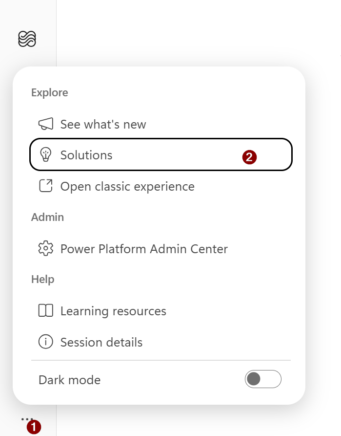
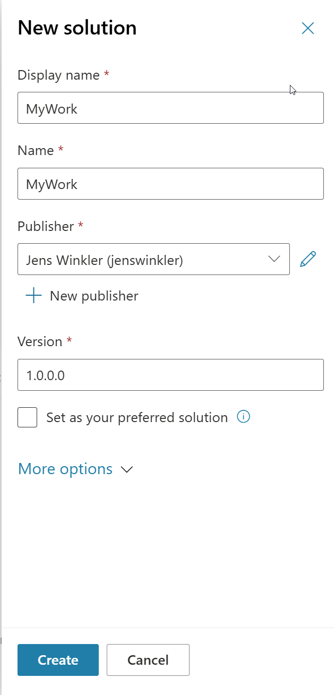
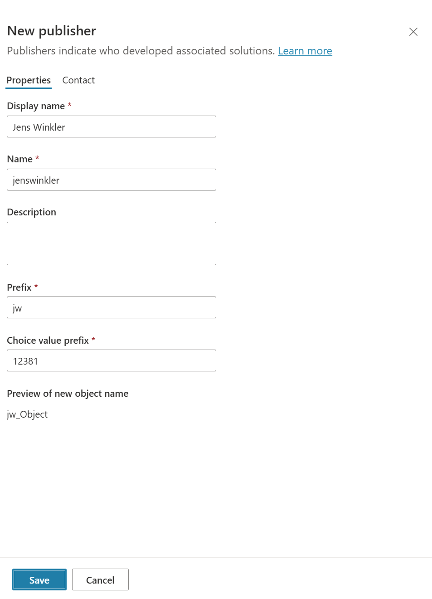
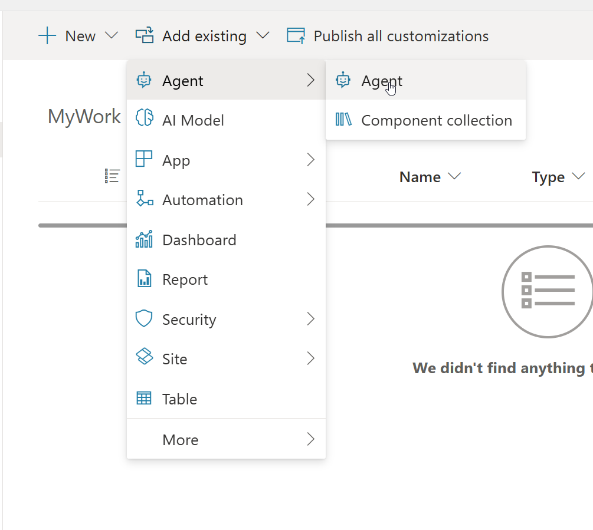
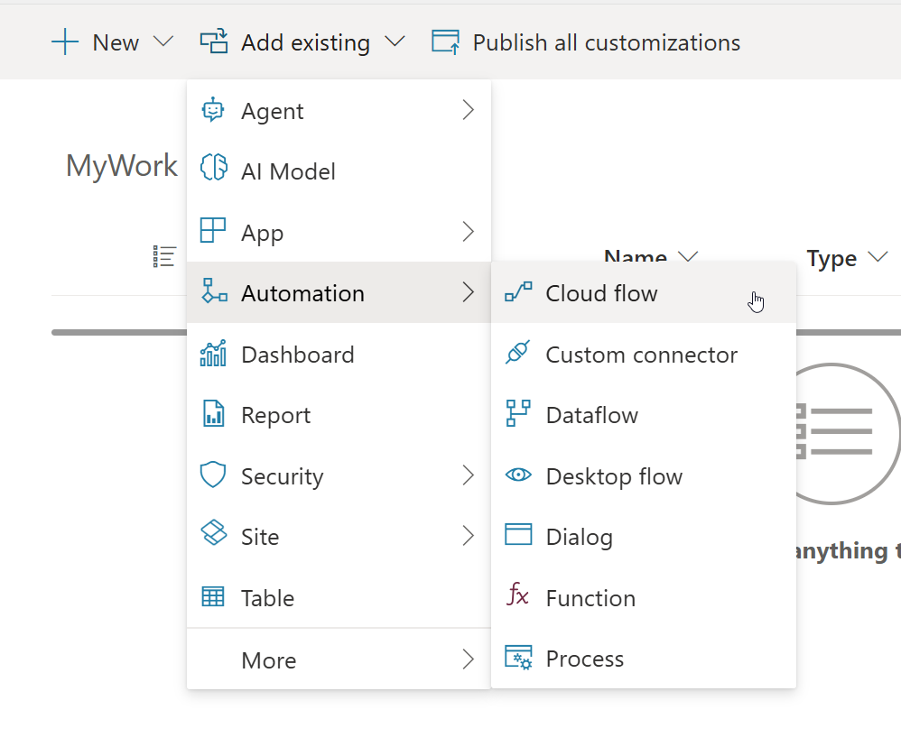
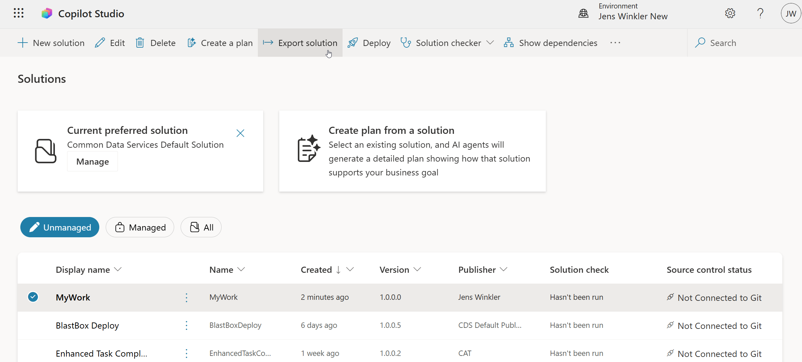
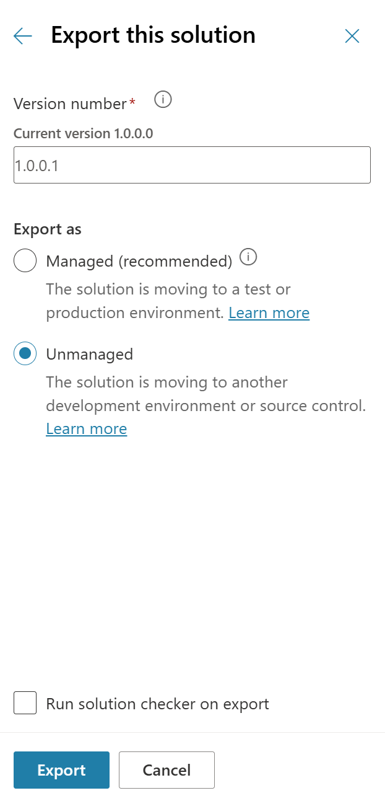

# Save Your Work - Export Your Agents and Workflows

Package everything you built in the temporary lab environment into a Power Platform solution and export it as an unmanaged `.zip`, so your work leaves the workshop with you.

---

## 🧭 Lab Details

| Level | Persona | Duration | Purpose |
| ----- | ------- | -------- | ------- |
| 100 | Maker/Developer | 20 minutes | After completing this lab, participants will be able to create a custom solution with their own publisher, add existing agents and workflows to it together with their required dependencies, and export the solution as an unmanaged package that can be imported into their own environment later. |

---

## 📚 Table of Contents

- [Why This Matters](#-why-this-matters)
- [Introduction](#-introduction)
- [Core Concepts Overview](#-core-concepts-overview)
- [Documentation and Additional Training Links](#-documentation-and-additional-training-links)
- [Prerequisites](#-prerequisites)
- [Summary of Targets](#-summary-of-targets)
- [Use Cases Covered](#-use-cases-covered)
- [Instructions by Use Case](#️-instructions-by-use-case)
  - [Use Case #1: Package your work into a custom solution](#-use-case-1-package-your-work-into-a-custom-solution)
  - [Use Case #2: Export and download the solution](#-use-case-2-export-and-download-the-solution)

---

## 🤔 Why This Matters

**Everyone who just spent a day building agents in a lab tenant** - the environment you are working in is temporary. When the workshop ends, it gets reset or deleted, and everything you built goes with it.

Think of the lab environment as a hotel room:
- **Without exporting**: You check out and leave your laptop, your notes, and your work on the desk. Housekeeping clears the room.
- **With exporting**: You pack a single bag, walk out with it, and unpack in your own house exactly where you left off.

**Common challenges solved by this lab:**
- "I built a great agent in the workshop but I have no way to show it to my team"
- "I want to keep iterating on this in my own tenant, not rebuild it from scratch"
- "I exported something, but the import failed because components were missing"
- "I exported the solution and half my changes weren't in it"

**This takes 20 minutes at the end of the day and saves you a full rebuild later.**

---

## 🌐 Introduction

Every agent, workflow, and component you create in Copilot Studio lives inside a Power Platform *solution*. By default, that is the **Common Data Services Default Solution** - a catch-all container that you cannot export. To move work between environments, you create your own **custom solution**, add your components to it, and export that solution as a `.zip` file.

**Real-world example:** You spent the workshop building an IT support agent with a knowledge source, three tools, and an approval workflow. On Monday you want to demo it to your manager in your company's development environment. Without an export, you open a blank Copilot Studio and start over. With an export, you upload a 400 KB `.zip`, import it, reconnect the connections, and demo the same agent you built on Friday.

The same mechanism is the foundation of real application lifecycle management: the solution you build here is exactly what teams move from development to test to production, and exactly what gets checked into source control.

---

## 🎓 Core Concepts Overview

| Concept | Why it matters |
|---------|----------------|
| **Solution** | The carrier that holds your agents, workflows, and their components. It is the only supported way to move Copilot Studio work between environments. |
| **Publisher and prefix** | Identifies who built the components. The prefix is prepended to the internal name of everything you create, so a consistent publisher keeps your components identifiable and avoids collisions with other solutions. |
| **Unmanaged vs. managed** | Unmanaged is your editable source - use it to move work to another development environment or into source control. Managed is locked and intended for test and production. You can't export a managed solution, so unmanaged is what you want here. |
| **Add existing** | Agents you built during the labs already exist in the default solution. **Add existing** references them into your custom solution so they can travel with it. |
| **Add required objects** | An agent depends on topics, knowledge, connection references, and environment variables. Adding the agent alone is not enough - the dependencies have to come along or the import fails in the target environment. |
| **Publish before export** | Only published customizations are exported. Unpublished edits silently stay behind. |

---

## 📄 Documentation and Additional Training Links

* [Create and manage solutions in Copilot Studio](https://learn.microsoft.com/microsoft-copilot-studio/authoring-solutions-overview)
* [Export and import agents using solutions](https://learn.microsoft.com/microsoft-copilot-studio/authoring-solutions-import-export)
* [Create a solution (Power Apps)](https://learn.microsoft.com/power-apps/maker/data-platform/create-solution)
* [Export solutions (Power Apps)](https://learn.microsoft.com/power-apps/maker/data-platform/export-solutions)
* [Import, update, and export solutions (Power Apps)](https://learn.microsoft.com/power-apps/maker/data-platform/import-update-export-solutions)
* [Solution concepts - Power Platform ALM](https://learn.microsoft.com/power-platform/alm/solution-concepts-alm)

---

## ✅ Prerequisites

* Access to the Copilot Studio lab environment, with at least the **System Customizer** security role in that environment.
* At least one agent that you built during the labs. Any workflows, agent flows, or custom connectors you want to keep as well.
* Your agents and workflows are **saved and published** - unpublished changes are not exported.
* A browser that can download `.zip` files, and somewhere durable to put the file (OneDrive, a Git repo, a USB drive - not the lab VM's desktop).
* Optional, for the follow-up: a target environment you control, such as a [Power Platform developer environment](https://learn.microsoft.com/power-platform/developer/plan-developer-tool).

---

## 🎯 Summary of Targets

In this lab, you'll turn a day of workshop output into a single portable file. By the end of the lab, you will:

* Open the solution explorer in Copilot Studio.
* Create your own publisher with a meaningful prefix.
* Create a custom, unmanaged solution.
* Add your existing agents and workflows to that solution, together with their required objects.
* Export the solution as an unmanaged package and download the `.zip` file.
* Understand what does *not* travel with the export and what to reconfigure after import.

---

## 🧩 Use Cases Covered

| Step | Use Case | Value added | Effort |
|------|----------|-------------|--------|
| 1 | [Package your work into a custom solution](#-use-case-1-package-your-work-into-a-custom-solution) | Collect scattered agents and workflows into one container that can leave the environment | 12 min |
| 2 | [Export and download the solution](#-use-case-2-export-and-download-the-solution) | Produce a portable `.zip` you can import into your own tenant | 8 min |

---

## 🛠️ Instructions by Use Case

---

## 🧱 Use Case #1: Package your work into a custom solution

Create a publisher and a custom solution, then add the agents and workflows you built during the labs.

| Use case | Value added | Estimated effort |
|----------|-------------|------------------|
| Package your work into a custom solution | Collect scattered agents and workflows into one container that can leave the environment | 12 minutes |

**Summary of tasks**

In this section, you'll learn how to open the solution explorer in Copilot Studio, create a publisher and a custom solution, and add existing agents and workflows to it along with their dependencies.

**Scenario:** The workshop is nearly over. Your agent works, your workflow runs, and the environment you built them in will be recycled. Before you leave, you collect everything into one solution.

### Objective

Create an unmanaged solution in the lab environment that contains every component you want to take with you.

---

### Step-by-step instructions

#### Open the solution explorer

1. In [Copilot Studio](https://copilotstudio.microsoft.com), check the **Environment** name in the top-right corner. Make sure you are in the lab environment where you built your agents.

2. On the side bar, select the three dots (**…**), then select **Solutions**.

    

    The solution explorer opens and lists the solutions in the environment.

> [!NOTE]
> Agents you create in Copilot Studio land in the **Common Data Services Default Solution** by default. That solution can't be exported, which is exactly why you create a custom one in the next steps.

#### Create a publisher

3. On the command bar, select **+ New solution**. The **New solution** pane opens on the right.

    

4. Under **Publisher**, select **+ New publisher**. The **New publisher** pane opens.

5. Fill in the **Properties** tab:

    | Field | Value |
    |-------|-------|
    | **Display name** | Your own name |
    | **Name** | Generated from the display name - leave it as-is |
    | **Description** | Optional |
    | **Prefix** | Your initials or a short team code |
    | **Choice value prefix** | Leave the generated number as-is |

    

    **Preview of new object name** shows what your prefix does: a new object is named `<prefix>_Object`.

6. Select **Save**. You return to the **New solution** pane with your new publisher selected.

> [!TIP]
> Keep the prefix short (2-5 characters) and reuse the same publisher across all your solutions. The prefix becomes part of the internal name of every component you create, and it can't be changed afterward.

#### Create the solution

7. Back in the **New solution** pane, complete the remaining fields:

    | Field | Value |
    |-------|-------|
    | **Display name** | `MyWork` |
    | **Name** | `MyWork` (generated from the display name) |
    | **Publisher** | The publisher you just created |
    | **Version** | `1.0.0.0` |

8. Leave **Set as your preferred solution** cleared, and select **Create**.

    The solution is created as **unmanaged** and opens automatically. If it doesn't, return to the solution list and select **MyWork**.

> [!IMPORTANT]
> New solutions are unmanaged by default, and only unmanaged solutions can be exported. Don't convert this solution to managed - if you do, you will have to create a new one.

#### Add your agents

9. On the solution's command bar, select **Add existing** > **Agent** > **Agent**.

    

10. In the **Add existing agents** list, select every agent you want to keep, then select **Add**.

    The agents appear in the **Objects** pane under **Agents**.

#### Add your workflows and flows

11. Select **Add existing** > **Automation** > **Cloud flow**.

    

12. Select the workflows and agent flows you built during the labs, then select **Add**.

> [!TIP]
> The same **Add existing** menu is where the rest of your work lives: **Automation** > **Custom connector** for custom connectors, **More** > **Environment variable** for environment variables, **Automation** > **Custom connector** plus the matching connection reference for connector-based tools, and **Agent** > **Component collection** for shared component collections.

#### Pull in the dependencies

13. In the **Objects** pane, select **Agents**, and find your agent in the list.

14. Open the commands menu (**⋮**) next to the agent, select **Advanced**, and then select **Add required objects**. Confirm when prompted.

    This pulls in the topics, knowledge, connection references, and environment variables your agent depends on.

15. Repeat step 14 for each agent and each workflow in the solution.

> [!IMPORTANT]
> This step is the single most common reason an import fails later with a missing-dependency error. Run **Add required objects** every time you add a new component to the solution.

16. On the command bar, select **Publish all customizations** and wait for it to finish.

---

###  🏅 Congratulations! You've completed Use Case #1!

---

### Test your understanding

**Key takeaways:**

* **A custom solution is the container** – the default solution can't be exported, so packaging your work into your own solution is the first and non-negotiable step.
* **The publisher prefix is permanent** – it is stamped into the internal name of every component and can't be changed after the fact, so choose it deliberately.
* **Adding a component is not the same as adding its dependencies** – **Add required objects** is what makes the package self-contained.

**Lessons learned & troubleshooting tips:**

* If an agent doesn't show up in the **Add existing agents** list, check that you're in the environment where you built it - the **Environment** name is in the top-right corner.
* Removing an agent from a solution does *not* remove its components. If you change your mind, remove the components separately rather than leaving orphans behind.
* Don't delete or edit an agent's components (topics, for example) directly from the solution view. Edit agents through the normal Copilot Studio authoring experience, or export and import will fail.

**Challenge: Apply this to your own use case**

* Which components in your agent are *not* visible in the **Objects** pane, and where would they come from?
* If two people on your team both export solutions into the same target environment, what would their publisher prefixes need to look like?
* What would you name a solution that holds only the reusable pieces you'd want to share across several agents?

---

---

## 🔄 Use Case #2: Export and download the solution

Export the solution as an unmanaged package and download the `.zip` file to durable storage.

| Use case | Value added | Estimated effort |
|----------|-------------|------------------|
| Export and download the solution | Produce a portable `.zip` you can import into your own tenant | 8 minutes |

**Summary of tasks**

In this section, you'll learn how to export a solution, handle missing components, choose the right package type, and download the resulting file.

**Scenario:** The solution is assembled. Now you turn it into a single file that outlives the lab environment.

### Step-by-step instructions

1. In the solution explorer, go back to the list of solutions by selecting **Solutions** in the breadcrumb or the side bar.

2. Make sure the **Unmanaged** filter is selected, then select the row for your **MyWork** solution so the checkmark appears. On the command bar, select **Export solution**.

    

    The **Before you export** pane opens on the right.

3. In the **Before you export** pane, select **Publish all changes**, wait for publishing to complete, and then select **Next**.

> [!IMPORTANT]
> Only published customizations are exported. If you skip this step, any edit you made since your last publish is silently left out of the `.zip`.

4. If a **Missing required components** or **Manage solution dependencies** pane appears, select **Next** to add the missing components. Take the offer - it is the same dependency check as **Add required objects**, and skipping it is what produces failed imports.

5. The **Export this solution** pane opens. Set the options:

    | Option | Value |
    |--------|-------|
    | **Version number** | Accept the auto-incremented value, for example `1.0.0.1` |
    | **Export as** | **Unmanaged** |
    | **Run solution checker on export** | Leave cleared for this lab |

    

> [!IMPORTANT]
> Choose **Unmanaged**, not the recommended **Managed**. Managed is for test and production environments, where the solution is locked and can't be edited or re-exported. Unmanaged is the option that lets you keep building on your work in your own development environment or check it into source control.

6. Select **Export**.

    The export runs in the background and can take several minutes. A status banner on the **Solutions** page updates when it finishes.

7. When the banner reports that the export is complete, select **Download**. The `.zip` file lands in your browser's download folder.

    The file is named after the solution's unique name plus the version, for example `MyWork_1_0_0_1.zip`.

8. Move the file somewhere that survives the workshop: OneDrive, a Git repository, or a USB drive. **Do not** leave it on the lab VM.

> [!IMPORTANT]
> Don't open, edit, or re-zip the downloaded package. Any change to its contents causes the import to fail.

> [!TIP]
> To use the package later, open the solution explorer in your own environment, select **Import solution**, browse to the `.zip`, and follow the prompts. After the import, you will need to reconfigure connections and authentication, and publish the agent before it can be shared. See [Export and import agents using solutions](https://learn.microsoft.com/microsoft-copilot-studio/authoring-solutions-import-export).

---

###  🏅 Congratulations! You've completed Use Case #2!

---

### Test your understanding

* Why does the export offer **Managed** as the recommended option, and why is it the wrong choice for taking work home?
* What happens to an edit you made five minutes before exporting but never published?
* You import your solution into your own environment and the agent appears, but it can't reach your data source. What is missing, and where do you fix it?

**Challenge: Apply this to your own use case**

* Which of the agents you built this week would actually be worth rebuilding properly in your own environment, and which were throwaway experiments?
* If you exported this solution once a day during a multi-day project, what would the version numbers tell you?
* How would you split your work into more than one solution if different teams owned different parts of it?

---

## 🏆 Summary of learnings

True learning comes from doing, questioning, and reflecting—so let's put your skills to the test.

To make sure your work actually survives the environment it was built in:

* **Package before you need to** – export at the end of every lab day, not at the end of the workshop. An environment that has already been reset can't be exported from.
* **One publisher, used consistently** – a stable prefix keeps your components identifiable across every solution and environment you work in.
* **Publish, then export** – the export only ever contains published customizations, and the failure is silent.
* **Dependencies are your responsibility** – **Add required objects** before every export, and accept the missing-components prompt when it appears.
* **Unmanaged is source, managed is a deployment** – take unmanaged packages with you; ship managed packages to test and production.
* **An export is not a complete backup** – connections, authentication configuration, channel details, and the agent icon don't travel. Expect to reconfigure and republish after import.

---

### Conclusions and recommendations

**Taking-your-work-home golden rules:**

* Never build anything you care about directly in the default solution - set a preferred solution or create a custom one up front.
* Give the publisher a name and prefix you'd be happy to see in production two years from now.
* Run **Add required objects** every time the solution changes, not only before the first export.
* Always select **Publish all changes** in the **Before you export** pane, even when you're sure everything is published.
* Export as **Unmanaged** for anything you intend to keep working on; export as **Managed** only when you're deploying to test or production.
* Store the `.zip` somewhere durable and versioned - a Git repository beats a downloads folder.
* Plan the reconnect work: after import, reconfigure connections and authentication, then publish the agent before sharing it.

By following these principles, the work you do in any environment - a workshop tenant, a sandbox, a personal developer environment - becomes portable by default, and moving an agent from an experiment to a production deployment stops being a rebuild and becomes a file transfer.

---
